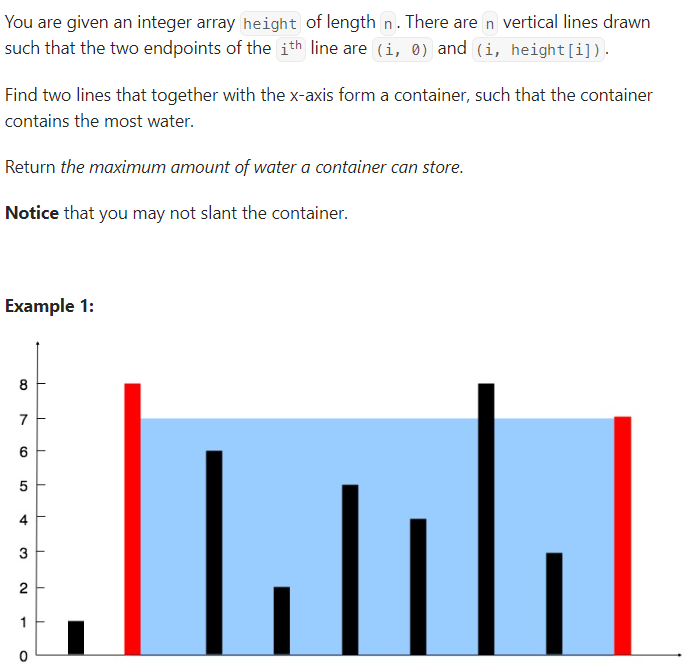

## We need to move min height inwards

#### The objective of the problem is to maximize min(heights[a], heights[b]) ⋅ (b - a). We start off the problem with the pointers at the edges. If either pointer moves inward, that second term (b - a) is always going to decrease, so that is out of our control. 

#### But if we move the higher-height pointer inward, the first term min(heights[a], heights[b]) can only decrease or remain fixed. To see why, note that there are two cases: 1) The higher-height pointer reaches an even higher height—since we are taking the min, the term will remain the same; 2) We reach a lower height—then the term may either stay fixed or decrease if it is lower than the other pointer's height.

#### On the other hand, moving the lower-height pointer inward, there are once again two cases: 1) The lower-height pointer reaches a higher height, then the term will always increase; 2) We reach a lower height, then the term decreases.

#### So in order to maximize the first term, min(heights[a], heights[b]), we must move the lower-height pointer inward, as moving the higher-height pointer inward yields only decreases (or fixed).
#### (note that the second term (b - a) is ensured to be as max as it can as we start the pointers at the edges, and move inward (thereby decreasing the term) to check for potential maximums, while keeping a max variable).

