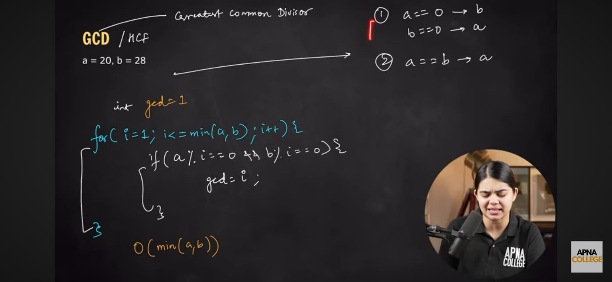
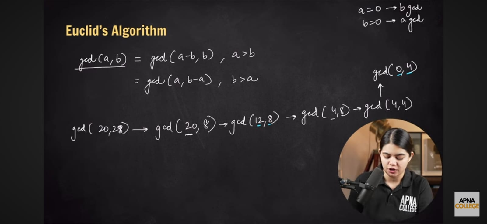
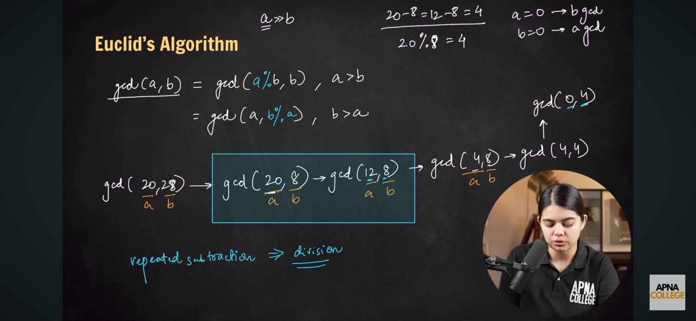
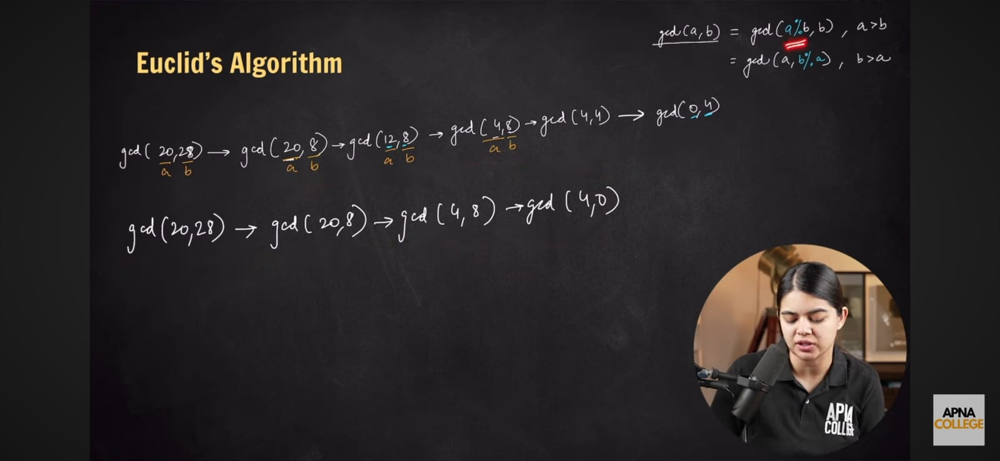

# Euclid's Algorithm

## Overview
Euclid's Algorithm is used to find the **Greatest Common Divisor (GCD)** of two integers. The GCD of two integers is the largest number that divides both without leaving a remainder.

---

## Brute Force Approach



---

## Euclid's Algorithm



---

## Optimized Euclid's Algorithm





----

# Code


```java
public class EuclidAlgorithm {
    public static int gcd(int a, int b) {        //b is the smallest number.
        if (b == 0) {
            return a;
        }
        return gcd(b, a % b);                    // a % b will become the smallest
    }
}
